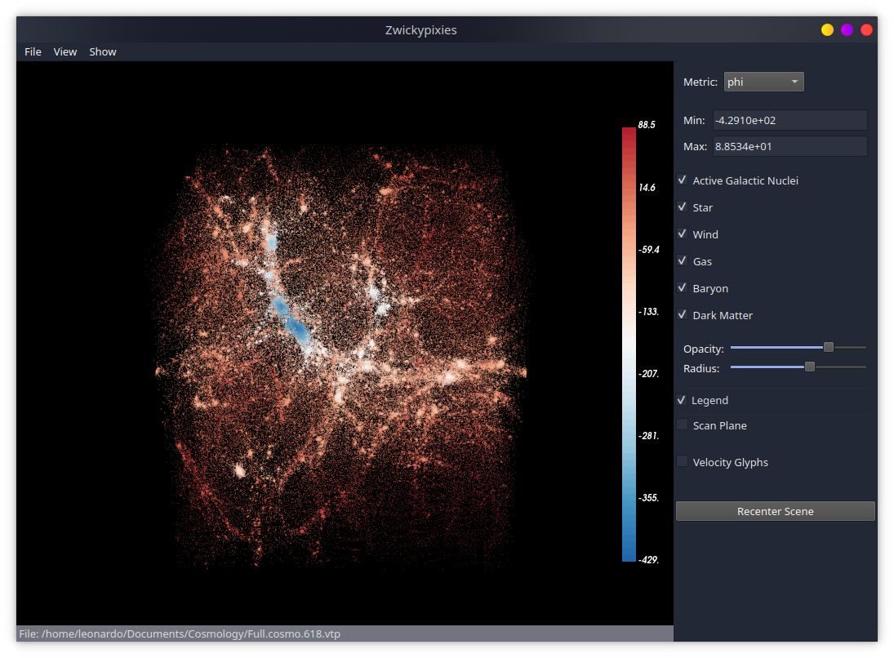
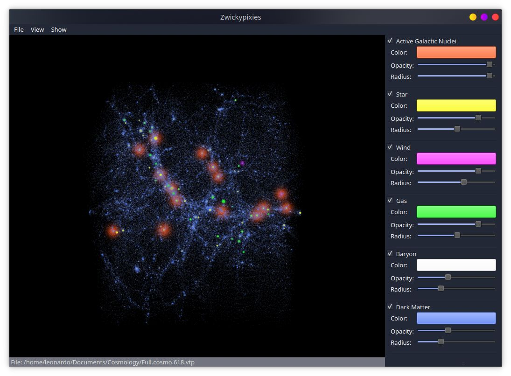
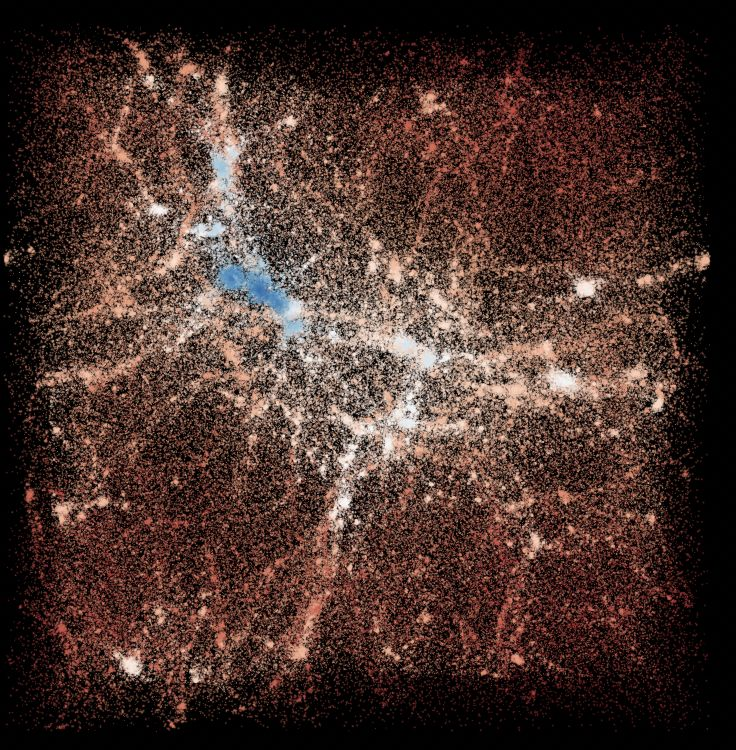
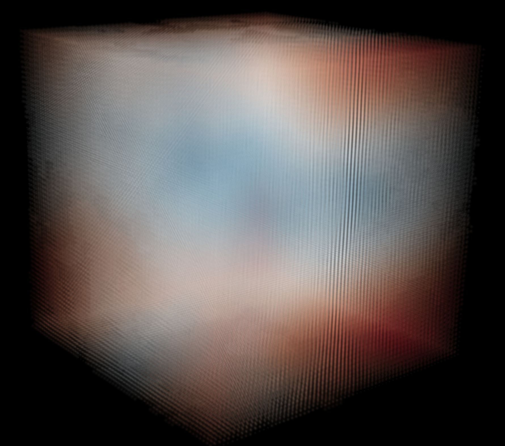

# Scientific Visualization: Cosmology Simulation of Dark Matter

This is the group project for the [scientific visualization course](https://cgl.ethz.ch/teaching/visualization23/home.php) by Fengshi Zheng, Cyrill Imahorn, Robert Veres, and Leonardo Salsi.

Cosmology simulation tells the story of how dark matter and baryons evolve in the universe through time. In the scope of our course, such results are represented by particle data, namely arrays of position, velocity, temperature, potential, and other physical quantities. For more details on the data layout, check [the description](data_description.txt).

We implemented an interactive tool for visualizing cosmology simulation results based on [VTK](https://vtk.org/) and [Qt](https://www.qt.io/), featuring the following visualizations: 
- scalar quantities (mass, temperature, potential, etc) by rendering particles as point gaussians with false colors.
- distribution of particle types (dark matter, baryon, AGN, star, etc) through user-specified colors.
- velocities by generating glyphs with varying colors and sizes.
- interpolation of scalar quantities on a plane.
- filtering particles by specifying thresholds on scalar quantities.

## Gallery

Data view mode:

Type explorer mode:

Viewing scalar properties:

Viewing velocity as glyphs:

Animation of the evolution of the universe: (click to play)

## How to Run

Make sure VTK and Qt are installed in python. Simply run `python3 main.py`.

Select "File -> Open" in the menu bar. Find the path to `data/Full.cosmo.622.vtp` to load the sample data. Explore the data by changing camera views by dragging the mouse, and changing the visualization parameters in the right panel.

Select "View -> Type Explorer, etc" to enter different visualization modes.

Have fun!

## Report

The course report can be found [here](Report.pdf).
